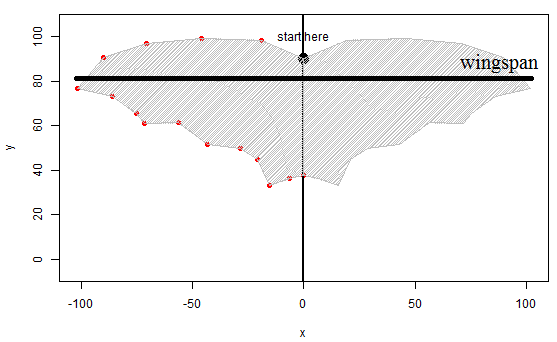
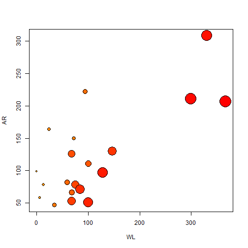

---
title       : Inquiry into flight performance
subtitle    : on example of creature made by you
author      : Maria Ghazali
job         : student at Coursera, Developing Data Producs
framework   : io2012        # {io2012, html5slides, shower, dzslides, ...}
highlighter : highlight.js  # {highlight.js, prettify, highlight}
hitheme     : tomorrow      # 
widgets     : [mathjax,quiz,bootstrap] # {mathjax, quiz, bootstrap}
mode        : selfcontained # {standalone, draft}
knit        : slidify::knit2slides

--- .class #id

## 2. Problem summary
Flight performance could be expressed by two wing characteristics - aspect ratio (AR) and wing loading (WL). Engineers can improve agility and maneuverability of winged creature by decreasing AR (like in forest raptors, hawks and long-eared bats). Otherwise they create robots with long and narrow winges (i.e. high AR), which are efficient in steady forward flight (like albatross or black mastiff bat). 

Efficient soaring and gliding flight is available for birds and bats with high AR. More lift (higher wing loading) is produced by animals with faster flight. Thus, fast fliers could afford to have larger size, but they lost in maneuvarability of flight.

In my application we will mimic [geometric morphometrics approach](https://en.wikipedia.org/wiki/Morphometrics). 

--- .class #id

## 3. Parameters used for analysis
- Body mass - $M$ ($kg$)
- Wingspan - distance between wingtips - $B$ ($m$)
- Wing area - area of both wings, body between wings and tail membrane - $S$ ($m^2$)
    - Aspect ratio: $B^2/S$ (dimensionless)
    - Wing loading: $M g/S$ ($N/m^2$), where $g$ - gravitational acceleration (9.81 $m/s^2$)

<p style="text-align:center">

</p>

--- &twocol1

## 4. Application

*** =left
Let's take some 20 animals. How aspect ratio and wing loading change with increase of mass?

```r
set.seed(1289)
wingspan <- rnorm(20,10,2) 
wingarea <- rnorm(20,1,0.4) 
mass <- seq(0.01,20,length.out=20)
AR <- wingspan^2/wingarea 
WL<- mass*9.81/wingarea
```

Size of points correlate with their mass:


```r
ramp <- colorRamp(c("orange", "red"))
col.pch<-rgb(ramp(seq(0, 1, length = 20)), max = 255)
plot(WL,AR,bg=col.pch,pch=21,cex=c(1:20)/5+0.5)
```

*** =right



--- .class #id

## 5. Technical details
- application 
    - server uses mouse clicking on the plot area to draw some outline and calculate aspect ratio and wing loading
    - ui is presented as tabset panel, it tracks mouse clicks and observe events from two independent buttons
    - ui is accompanied with help notes
    - require connection to internet to read data from csv file on github repository
- shiny application is at [shinyapps.io](https://mariaghazali.shinyapps.io/my_shiny_app_1)
- slides are [here](http://mariaghazali.github.io/my.1st.app/index.html)

